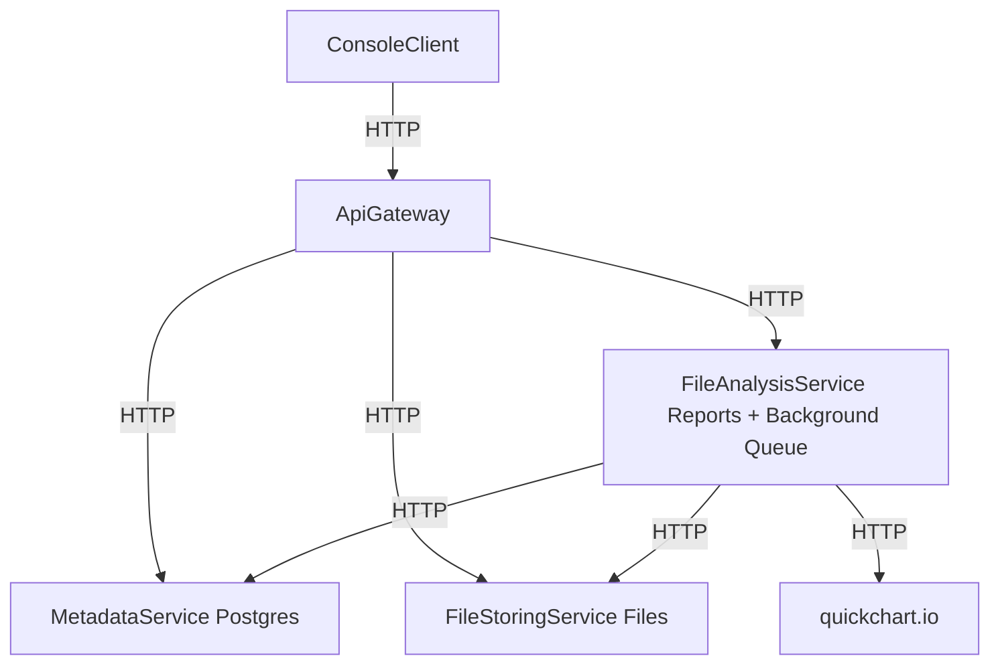

# Anti-Plagiarism System

## Обзор  
Это система на основе микросервисов для хранения студенческих работ, их анализа на предмет плагиата и генерации отчётов. Система реализует синхронное межсервисное взаимодействие через API Gateway. Поддерживается загрузка файлов, хранение метаданных, детекция плагиата с использованием шинглов и коэффициента Жаккара, а также визуализация в виде облака слов.

### Архитектура  
Система состоит из следующих компонентов:  
- **ApiGateway**: центральная точка входа; маршрутизирует запросы и интегрирует workflow сдачи работы (сохранение файла → сохранение метаданных → постановка в очередь на анализ).  
- **MetadataService**: хранит метаданные о сдачах в PostgreSQL (EF Core). Предоставляет эндпоинты для сдач, работ и отчётов.  
- **FileStoringService**: хранит файлы локально (смонтированный том). Эндпоинты для загрузки и скачивания файлов.  
- **FileAnalysisService**: выполняет асинхронный анализ файлов (фоновая очередь). Извлекает текст из файлов (.txt, .docx, .pdf), вычисляет хэш и шинглы, проверяет плагиат через Metadata, генерирует облако слов (QuickChart.io, сохраняется как PNG) и сохраняет отчёт.  
- **ConsoleClient**: консольный клиент для тестирования (Spectre.Console).

Диаграмма:  


## Сценарии использования

### Сдача работы  
Клиент отправляет POST-запрос на `/api/submit-work` (multipart: файл, studentId, assignmentId).  
- **ApiGateway**: отправляет POST `/files` → получает fileId.  
- **ApiGateway**: отправляет POST `/submissions` → получает workId.  
- **ApiGateway**: отправляет POST `/analyze` (постановка асинхронного анализа в очередь).  
- Возвращается статус `202 Accepted` с телом: `{workId, fileId, analysisQueued: true}`.

**Анализ (в фоне):**  
1. Загружается файл.  
2. Извлекается текст.  
3. Вычисляются хэш и шинглы.  
4. Проверяется плагиат:  
   - GET `/assignments/{assignmentId}/previous-submissions`  
   - Сравнение по коэффициенту Жаккара (> 0.8 → плагиат).  
5. Генерируется изображение облака слов (PNG).  
6. Сохраняется отчёт.  
7. Обновляются метаданные: `PUT /works/{workId}/reports/{reportId}`.

### Получение отчёта  
Клиент отправляет GET-запрос на `/api/works/{workId}/reports`.  
- **ApiGateway**: GET `/works/{workId}` → если ReportId = null, возвращается статус «в ожидании».  
- **ApiGateway**: GET `/reports/{reportId}` → объединяет данные работы и отчёта.  
- Возвращается объект:  
  ```json
  {
    "Work": { ... },
    "Report": {
      "plagiarism": true|false,
      "details": { ... },
      "wordCloudUrl": "..."
    }
  }
  ```

## Алгоритм детекции плагиата

### Простой режим (точное совпадение)  
Текст нормализуется (приведение к нижнему регистру, удаление знаков препинания и пробелов), вычисляется хэш SHA256. Выполняется поиск в Metadata по эндпоинту `/submissions/by-hash` на наличие дубликатов с более ранней датой `SubmittedAt`.

### Расширенный режим (сходство текстов)  
Нормализованный текст разбивается на 3-словные шинглы (n-граммы).  
Для заданного `assignmentId` извлекаются предыдущие сдачи:  
- GET `/assignments/{assignmentId}/previous-submissions?before={submittedAt}`  
- Тексты этих сдач извлекаются из FileStoringService  
- Формируются множества шинглов  
- Вычисляется коэффициент Жаккара: `|пересечение| / |объединение|`  
- Если значение > 0.8 для любой из предыдущих работ — фиксируется плагиат.

Порог сходства настраивается через `appsettings.json`. Расширенный режим устойчив к незначительным изменениям текста по сравнению с точным хэшированием.

## Настройка и запуск

### Локальная разработка  
1. Установите .NET 9 SDK и PostgreSQL.  
2. В MetadataService выполните:  
   ```bash
   dotnet ef database update
   ```  
   (используется `appsettings.Development.json` с локальной строкой подключения).  
3. Запустите сервисы по отдельности:  
   ```bash
   dotnet run --project src/MetadataService
   dotnet run --project src/FileStoringService
   dotnet run --project src/FileAnalysisService
   dotnet run --project src/ApiGateway
   ```  
4. Запустите клиент:  
   ```bash
   dotnet run --project src/ConsoleClient
   ```  
   (при необходимости задайте переменную окружения: `API_GATEWAY_URL=http://localhost:8080`).  
5. Документация Swagger доступна по адресу: `http://localhost:{port}/swagger` для каждого сервиса.

### Docker  
```bash
docker compose up --build
```  
- ApiGateway доступен по `http://localhost:8080`  
- Запуск клиента:  
  ```bash
  docker exec -it kpohw3-console-client-1 dotnet KpoHw3.ConsoleClient.dll
  ```  
- Используемые тома: `postgres_data`, `file_storage`, `report_storage`, `logs`.

## Тестирование  
- **Unit/Integration-тесты**: `dotnet test` (в проекте Tests).  
- **Ручное тестирование**: через ConsoleClient или Postman.  
  - Импортируйте коллекцию из Swagger.  
  - Или вручную:  
    - POST `/api/submit-work`: form-data (`file`, `studentId` (Guid), `assignmentId` (Guid))  
    - GET `/api/works/{workId}/reports`

**Обработка крайних случаев:**  
- Дубликаты файлов → `plagiarism = true`  
- Большие файлы → обрабатываются с ограничением по размеру  
- Нетекстовые файлы → отчёт генерируется без хэша/шинглов

## Зависимости  
- .NET 9  
- EF Core  
- Npgsql  
- Serilog  
- Swashbuckle  
- Polly  
- Spectre.Console  
- DocumentFormat.OpenXml  
- iTextSharp (для PDF)
